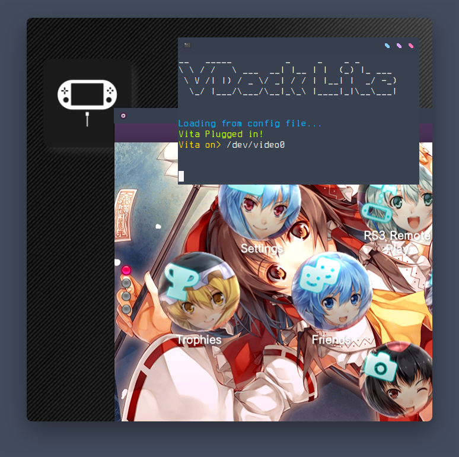

# VitaDock Lite  


Yet another Vita Dock but instead of an entire Linux distro or a Docker container its a standalone utility  

despite being called "Lite", VitaDockLite has all the features you need to turn your PC into a dock to stream your PlayStation Vita's display  

VDlite (for my hands sake) uses mpv to display the video output of the vita which we get via the `udcd_uvc.skprx` plugin (i recommend NOT using autoplugin/2)  

# Installation

## IMPORTANT NOTE  
VDlite is currently being rewritten thus it wont work OOTB  
to use the last working version clone the repo then run:  
```
git checkout 76ee4b5
```

The `install.sh` file will install everything alongside the dependencies (for debian and arch based linux distros) which can be easily ran like so:  
```
curl -sSL https://raw.githubusercontent.com/NekoMimiOfficial/VitaDockLite/main/install.sh | bash
```

if your distro isn't supported you can manually run the steps below:  
### Linux  
* clone the repo to ~/.local/share/VDlite  
* install python3, pip3, mpv, v4l-utils  
* install pip dependencies:  
[ globally ] -> `sudo -H pip3 install ~/.local/share/VDlite/pip/NekoMimi.whl`  
[ per user ] -> `pip3 install ~/.local/share/VDlite/pip/NekoMimi.whl`  
* `chmod +x ~/.local/share/VDlite/VDockLite`
* add the executable to your path  

### Windows  
* Hey Neko, please add Windblows support  

### Darwin(OSX)  
* Looking for help  

## ==============================

## Project info
So what's different about VDlite?  

VDlite doesnt force the user to install a new OS on their raspberry pi nor does it require docker  

has theme support (bootup splash) and background music for that dock feel  

### ToDo list:  
* []Add easy windows support  
* []Audio support  
* []Sync BGM from vita  
* []Recording support  
* []Switch to a better player than `mpv`  

### Configuration
VDlite is configured via a file under `$HOME/.config/VDockLite/options.conf` its well commented  


### More ?
Want to collab or talk? Hit me up! `Discord: nekomimiofficial`  

Made with <3 for the vita community :D  
~NekoMimi  
